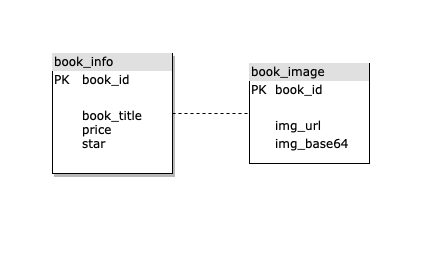

# de_assignment
for only de assignment

## Instruction for running this project

1. Clone this project by http or ssh


2. Create Virtual Environment and activate
  (Used in this project)
  ```
  virtualenv env
  source env/bin/activate
  ```
  
3. Install libary that used in this project
  ```
  pip install -r requirements.txt
  ```
  
4. Run docker build (make sure that docker desktop is running)
  ```
  docker-compose build
  ```
  
5. Run everything (Scrape all books and add to Postgres)
  ```
  docker-compose up
  ```
  
  ## ER DIAGRAM
  
  
  
  ## Random Samples image and info
  - Run get_random_image.py in order to retrieve images and info from PostgresSQL (DEFAULT = 10 images)
  ```
  python get_random_image.py
  ```
  
  - Images and info of thoes data will be saved in the folder
